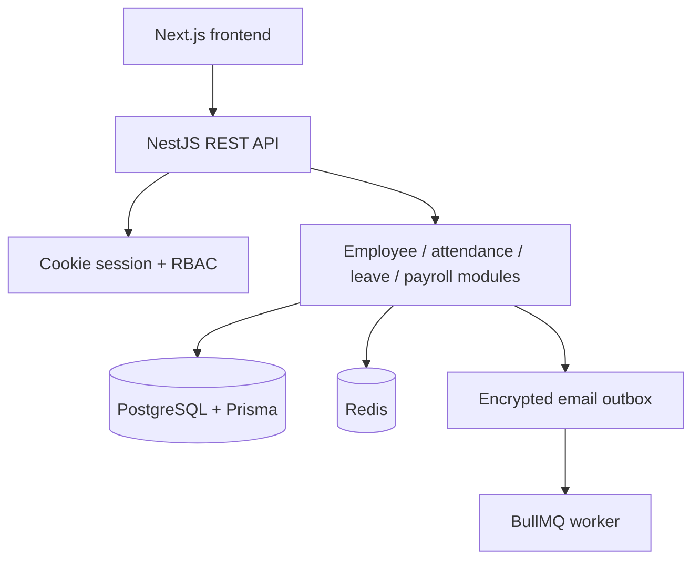

# Architecture

The service is a clean modular monolith. Nest modules own HTTP controllers and business services; Prisma is the only database data-access boundary; PostgreSQL is the system of record; Redis is used for authentication rate limits and BullMQ email jobs; local object storage is an adapter that can be replaced by S3/Azure Blob.

Transactions protect balance-changing leave workflows, attendance corrections, payroll processing/approval/locking, employee status changes, and audit writes. Decimal database values are preserved through Prisma Decimal; API monetary fields are serialized as strings.

## Data boundaries

- `RawPunch` is immutable input; `Attendance` is calculated state.
- `LeaveBalance.reserved` prevents concurrent requests from overspending entitlement before approval.
- `PayrollEmployee.snapshot` records the effective employee, attendance, structure version, policy timezone, and calculation version used for a payslip.
- `AuditLog` is append-only and redacts passwords, tokens, secrets, bank ciphertext, and unnecessary sensitive fields.
- All historical employment, attendance, leave, payroll, and document records are retained through status/soft-archive flows.
